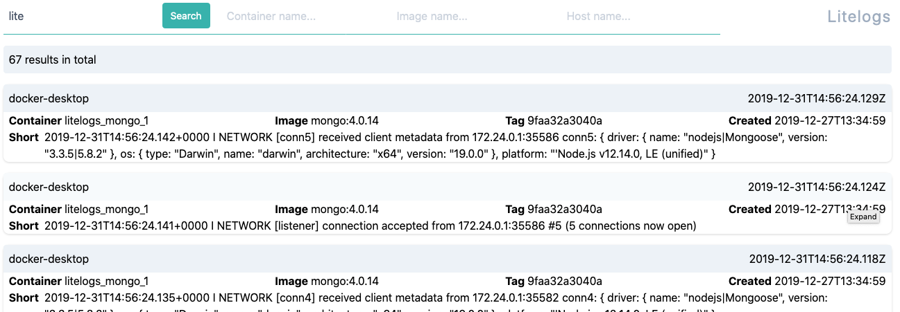

# Litelogs

Litelogs is a _very_ simple log aggregator geared towards docker containers.  It listens for incoming messages in GELF format and stores
them in MongoDB.  There is a web front-end which lets you search the logs via simple strings or regex.

__NOTE:__ This is a very early work-in-progress and should _not_ be used in production.



## Features

* It's very lightweight - around 25mb for the main process
* Can be scaled up very easily
* Customise log-retention duration
* Can forward incoming logs onto another server if needed for archive or further processing

## Project setup
```
# backend
npm install
node src/index.js

# frontend
cd frontend
cp .env.example .env # you can change the values in there used to connect to the backend etc
npm install
npm run serve # for a live/dev session
npm run build # to do a production build into ./dist/
```

## Docker demo

If you have docker-compose available you _should_ be able to run

```
docker-compose up --build
```
After a little while you should have the front-end available at http://localhost:3002/ (default username/password is 'admin'/'secret' and a copy of mongo-express running at http://localhost:8081/ if you want to dig into the actual database.

## Configuration options

```
--debug                      output extra debugging
--api-debug                  log api requests
--no-alive                   don't output alive messages
--mongo <connection-string>  connection string for mongodb (default:
                            "mongodb://localhost:27017/litelogs")
--port <port-number>         port number to listen on (default: 12201)
--ip <ip-address>            IP address to bind to (default: "0.0.0.0")
--ttl <hours>                number of hours to retain logs (default: 672 (4 weeks))
--user <username>            username for mongodb (default: "")
--password <password>        password for mongodb (default: "")
--forward <gelf-server>      forward messages to this server (default: "")
--api-port <port-number>     port for the api server (default: 3001)
--api-key <string>           The api key to use (default: "")
--disable-metrics            Disable prometheus metrics (default: false)
--prom-user <string>         Optional basic-auth prometheus user (default: "")
--prom-pass <string>         Optional basic-auth prometheus password (default: "")
--max-api-results <number    Maximum number of results to return in one api query (default: 100)
-h, --help                   output usage information
```
Most options are also available to be set via environment variables :
```
--mongo == LITELOG_MONGO
--port == LITELOG_PORT
--ip == LITELOG_IP
--ttl == LITELOG_TTL
--user == LITELOG_USER
--password == LITELOG_PASSWORD
--forward == LITELOG_FORWARD
--api-port == LITELOG_API_PORT
--api-key == LITELOG_API_KEY
--disable-metrics == LITELOG_DISABLE_METRICS
--prom-user == LITELOG_PROM_USER
--prom-pass == LITELOG_PROM_PASS
--max-api-results == LITELOG_MAX_API_RESULTS
```

## API

There is one main API endpoints listening on the API port passed via `--api-port`:
```
GET /search?q=string&host=hostname&container=container_name&image=image_name&page=1
```
This will do a regex search for the 'string' and also try to limit the results by host, container, image and return the first 'page' of results. Only the `q=string` part is required.  Eg, to search for logs containing 'mongodb' produced by the container 'myamazingapp' :
```
GET /search?q=mongodb&container=myamazingapp
```
You can pass an api key when starting the server via `--api-key` which will then check for an `X-Auth` header on the incoming request with a matching value.

## Metrics

By default prometheus-friendly metrics are exposed at a `/metrics` API endpoint on the same port as given by `--api-port`.  You can disable them being gathered/served by passing the `--disable-metrics` option.  You can also pass and optional username & password (`--prom-user`, `--prom-pass`) which will be used to add an HTTP basic auth challenge on the `/metrics` route.
